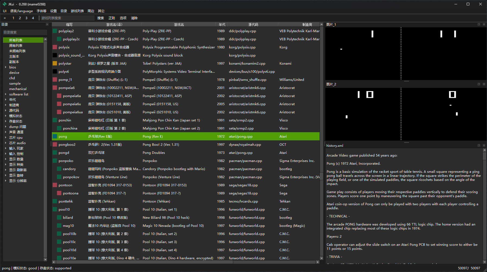

# JKui

JKui 是配合 街机模拟器 MAME 使用的前端，用于显示 MAME 的游戏列表。

（ 街机模拟器 MAME 网址 : https://www.mamedev.org/ ）

---------

以前写过的 JJui （ https://github.com/gdicnng/JJui ），编号加一位，简单取名 JKui 。

使用 QT （ Python 版 QT ）重写一下，感觉可能会好看一点。

---------
Python 3.13

QtPy 2.4.3

PySide6 6.8.3
